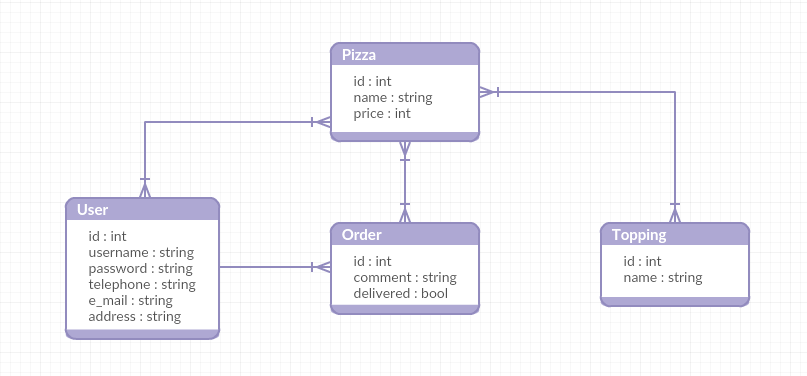

# Pizzéria
## Feladat leírása
Egy pizzéria online rendelő felületének megvalósítása.
## Funkcionális követelmények
* Vendég
  * Regisztráció és Bejelentkezés
  * Pizza áttervezése
  * Pizzarendelés
* Regisztrált felhasználó
  * Új cím megadása és mentése
  * Pizza hozzáadása a kedvencekhez
  * Korábbi rendelések megnézése és újrarendelése
  * Pizza áttervezése (feltét levétele, hozzáadása)
  * Pizzarendelés
* Adminisztrátor
  * Pizza hozzáadása a választékhoz
  * Pizza törlése a választékból
  * Felhasználók rendeléseinek megtekintése
  * Leadott rendelés módosítása
  * Rendelések törlése
  * Felhasználó törlése
## Nem funkcionális követelményei
* Felhasználóbarát kinézet, könnyű kezelhetőség
* Gyors alkalmazás
* Adatvédelem, különböző hozzáférési jogosultságok megfelelő kiosztása
## Adatbázis terv

## Szakterületi fogalomjegyzék
* Pizza
  * Olasz eredetű étel, ami mára az egész világon elterjedt. Alapja egy kelt tésztából készült vékony lepénykenyér, melyet paradicsom vagy tejföl alapú szósszal borítanak, és erre különféle feltétek kerülnek, a tésztát végül reszelt sajttal szórják meg és sütőben megsütik.
## Szerepkörök
* Vendég
  * Az alapértelmezett szerepkör az oldal megnyitásakor, regisztrálhat vagy bejelentkezhet, illetve az adatai tárolása nélkül rendelést adhat le.
* Regisztrált felhasználó
  * A rendelés leadáson kívül, új címet adhat meg és menthet el, készíthet listát a kedvenc pizzáiból, megnézheti a korábbi rendeléseit. 
* Adminisztrátor
  * Szerkesztheti a kínálatot, módosíthatja vagy törölheti a felhasználók rendeléseit, törölheti a felhasználót.
  
## Végpontok
* GET	/signup	Regisztrációs oldal megjelenítése
* POST /signup	Regisztráció
* GET	/login	Bejelentkező oldal megjelenítése
* POST	/login	Bejelentkezés
* GET	/logout	Kijelentkezés
* GET	/profile	Saját profil megtekintése
* GET	/profile-edit	Saját profil módosítása oldal megjelenítése
* POST	/profile-edit	Saját profil módosítása
* GET	/orders	Saját utolsó három listázása
* POST /orders	Saját választott havi rendelések listázása
* GET	/orders/new	Új rendelés hozzáadása oldal megjelenítése
* POST /orders/new	Új rendelés hozzáadása
* GET /orders/:id/delete Adott azonosítójú rendelés törlése
* GET	/pizzas/:id/toppings Feltétek kilistázása
* GET /pizzas/:id/toppings/:id/new Új feltét hozzáadása ablak megjelenítése
* POST /toppings/new Új feltét hozzáadása
* GET	/search	Keresés a pizzák között
* GET	/favorite	Kedvenc pizzák listázása listázása
* GET /favorite Kedvenc pizzák listájának megjelenítése
* POST /favorite Pizza hozzáadása a kedvencek listájához
* GET /pizzas Pizzák listájának megjelenítése
* POST /pizzas/new Új pizza hozzáadása
## Fejlesztői környezet
* Java JVM
* h2 adatbázis kezelő
* NetBeans IDE
* spring-boot
